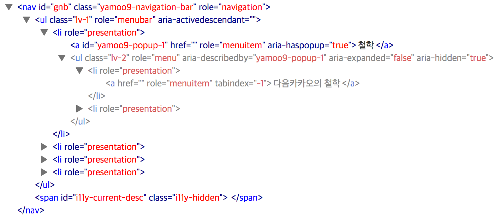

## 플러그인 제작 프로세스 ━ STEP 2

STEP2 과정에서 처리되는 class 속성 및 WAI-ARIA 적용 결과 화면 스크린샷입니다. 플러그인에 설정된 class 속성 및 role, aria- 속성 및 상태 처리 결과를 볼 수 있습니다.



-

#### `<nav>` 요소 마크업 변경

> src/html/common/_header.html

```html
<nav id="gnb">
	<ul>
		<li>
			<a href="">철학</a>
			<ul>
				<li><a href="">다음카카오의 철학</a></li>
				<li><a href="">프라이버시 보호 책임자</a></li>
			</ul>
		</li>
		<li>
			<a href="">투명성</a>
			<ul>
				<li><a href="">개인정보 라이프 사이클</a></li>
				<li><a href="">투명성 보고서</a></li>
				<li>
					<a href="">op</a>
					<ul>
						<li><a href="">야무.</a></li>
						<li><a href="">청춘아!!</a></li>
					</ul>
				</li>
			</ul>
		</li>
		<li>
			<a href="">보호노력</a>
			<ul>
				<li><a href="">기술적 보호노력</a></li>
				<li><a href="">프라이버시 정책 자문위원회</a></li>
				<li><a href="">정보보호 인증</a></li>
			</ul>
		</li>
		<li>
			<a href="">동향</a>
		</li>
	</ul>
</nav>
```

-

#### 사용자 정의 옵션 aria 설정 추가 후, WAI-ARIA 설정 여부 테스트

> src/js/pages/main.js

```js
var $gnb = $('#gnb').navigationBar({
	'prefix': 'yamoo9',
	// 'aria'  : false,
});
```

-

#### 플러그인 테마 제작

> src/js/plugins/navigationBar/jquery.navigationBar.css

```css
/*! jquery.navigationBar.css © yamoo9.net, 2015 */

.i11y-hidden {
	overflow: hidden;
	position: absolute;
	clip:     rect(0 0 0 0);
	clip:     rect(0,0,0,0);
	width:    1px;
	height:   1px;
	margin:   -1px;
	padding:  0;
	border:   0;
}
.i11y-hidden.focusable:focus,
.i11y-hidden.focusable:active {
	overflow: visible;
	position: static;
	clip:     auto;
	width:    auto;
	height:   auto;
	margin:   0;
}

.yamoo9-navigation-bar .lv-2,
.yamoo9-navigation-bar .lv-3 {
	display: none;
}
```

-

#### 플러그인 테마 파일 호출

> src/css/style.css

```css
/* jquery.navigationBar 플러그인: 테마 */
@import "../js/plugins/navigationBar/jquery.navigationBar.css";
```

-

#### `$.fn.navigationBar` 플러그인 제작

> src/js/plugins/navigationBar/jquery.navigationBar.js

0. **플러그인 초기 옵션에 속성 추가**
	```js
	/**
	 * 플러그인 기본 옵션
	 * -------------------------------- */
	$.fn[plugin].defaults = {

		// 회사 식별자(접두사)
		'prefix': 'y9',

		// <nav> 클래스 속성
		'navClass': 'navigation-bar',

		// 레벨(뎁스) 클래스 속성
		'lvClasses': {
			'lv1': 'lv-1',
			'lv2': 'lv-2',
			'lv3': 'lv-3',
		},

		// WAI-ARIA 설정
		'aria': true,

	};
	```

1. **`NavigationBar` 객체 생성자 함수 내부에 플러그인 적용 대상(요소) 설정**
	```js
	/**
	 * 플러그인 객체 생성자
	 * -------------------------------- */
	var NavigationBar = function($el, options) {

		// 플러그인 적용 대상 객체 참조 및
		// 옵션 오버라이딩(덮어쓰기)
		this.$el    = $el;
		this.el     = $el[0];
		this.config = $.extend(true, {}, $.fn[plugin].defaults, options);

		// 레벨 1, 2, 3 요소 참조
		this.$lv1 = this.$el.children('ul');
		this.$lv2 = this.$lv1.children('li').children('ul');
		this.$lv3 = this.$lv2.children('li').children('ul');

		// 메뉴아이템 ID 인덱스
		this.menuitemIndex = 0;

		// 플러그인 초기화 실행
		this.init();
	};
	```

2. **`NavigationBar` 프로토타입 객체 `init()` > `settings()` 설정**
	```js
	/**
	 * 플러그인 객체 생성자 프로토타입
	 * -------------------------------- */
	NavigationBar.prototype = {
		/**
		 * 초기화
		 * --------------------------------
		 */
		'init': function() {
			// 초기화: 플러그인 환경설정
			this.settings();
		},

		/**
		 * 설정: class, WAI-ARIA
		 * --------------------------------
		 */
		'settings': function() {
			// 클래스 속성 설정
			this.setClass();
			// WAI-ARIA 설정 유무 확인 후 처리
			this.config.aria && this.setARIA();
		},
	```

3. **`settings()` > `setClass()` 설정**
	```js
	// 설정: class 속성
	'setClass': function() {
		var config = this.config;
		// nav 클래스 속성 설정
		this.$el.addClass( config.prefix + '-' + config.navClass );
		// nav > ul 클래스 속성 설정
		this.$lv1.addClass( config.lvClasses.lv1 );
		// nav > ul > li > ul 클래스 속성 설정
		this.$lv2.addClass( config.lvClasses.lv2 );
		// nav > ul > li > ul > li > ul 클래스 속성 설정
		this.$lv3.addClass( config.lvClasses.lv3 );
	},
	```

4. **`settings()` > `setARIA()` 설정**
	```js
	// 설정: WAI-ARIA 역할/속성/상태
	'setARIA': function() {
		this.setARIARoles();      // 역할 설정
		this.setARIAProperties(); // 속성 설정
		this.setARIAStates();     // 상태 설정
	},
	```

5. **`setARIA()` > `setARIARoles()` 설정**
	```js
	// 설정: WAI-ARIA 역할
	'setARIARoles': function() {
		// nav 역할: navigation 설정
		this.$el.attr('role', 'navigation');
		// nav li 역할: presentation 설정
		this.$el.find('li').attr('role', 'presentation');
		// nav a 역할: menuitem 설정
		this.$el.find('a').attr('role', 'menuitem');
		// nav > ul 역할: menubar 설정
		this.$lv1.attr('role', 'menubar');
		// nav > ul > li > ul, nav > ul > li > ul > li > ul 역할: menu 설정
		this.$lv2.add(this.$lv3).attr('role', 'menu');
	},
	```

6. **`setARIA()` > `setARIAProperties()` 설정**
	```js
	// 설정: WAI-ARIA 속성
	'setARIAProperties': function() {
		var widget    = this,
			$menuitem = widget.$el.find('a');
		$.each($menuitem, function(index, el) {
			var $item = $menuitem.eq(index);
			// nav a 속성: 인접한 요소(메뉴)를 가지고 있는 nav a일 경우
			if( $item.next().length ) {
				// nav a 속성
				$item.attr({
					// id 속성 설정 (this.menuitemIndex 선 증가)
					'id': widget.config.prefix + '-popup-' + ++widget.menuitemIndex,
					// aria-haspopup 속성 설정
					'aria-haspopup': true
				})
				// nav a + ul 속성 설정
				.next().attr('aria-describedby', $item.attr('id'));
			}
		})
	},
	```

7. **`setARIA()` > `setARIAStates()` 설정**
	```js
	'setARIAStates': function() {
		// 현재 상태를 제공할 span 요소 생성
		$('<span>', {
			'id': 'i11y-current-desc',
			'class': 'i11y-hidden'
		}).appendTo( this.$el );

		// 메뉴바(ul) 요소에 현재 활성화된 상태의 ID 설정을 위한 준비
		this.$lv1.attr('aria-activedescendant', '');

		// 메뉴아이템(a) 요소 중 첫번째를 제외한 나머지 요소는 tabindex 속성 값을 -1로 설정
		this.$el.find('a:not(:eq(0))').attr('tabindex', -1);

		// 메뉴(ul) 요소를 순환하여 펼쳐짐 상태 확인 및
		// 펼쳐짐 상태, 보임 상태 설정
		var $menus = this.$lv1.find('ul'); // lv2, lv3
		$.each($menus, function(index, el) {
			var $menu = $menus.eq(index);
			if ( $menu.is(':visible') ) {
				$menu.attr({
					'aria-expanded': true,
					'aria-hidden': false
				});
			} else {
				$menu.attr({
					'aria-expanded': false,
					'aria-hidden': true
				});
			}
		});
	},
	```